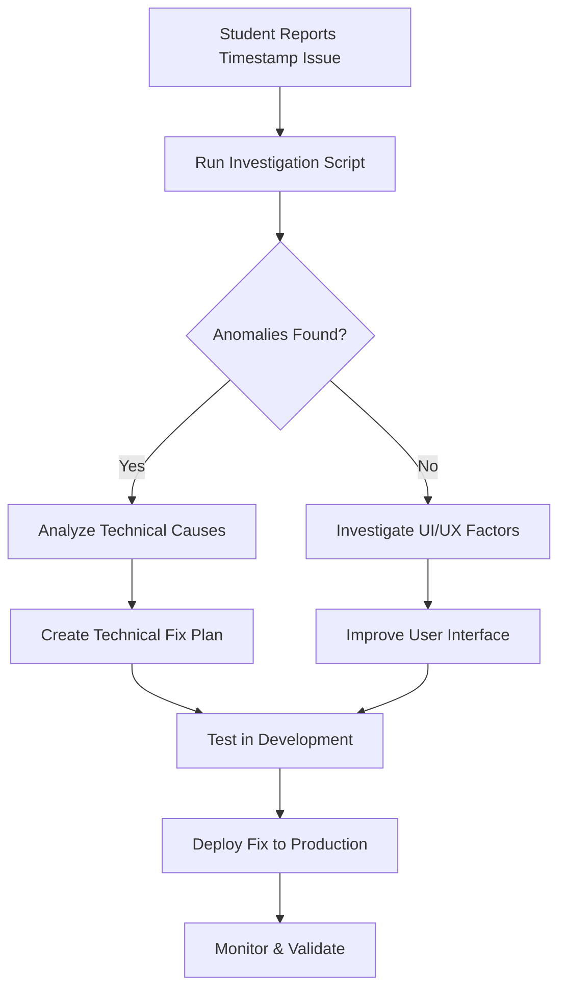

# 🔐 SECURITY PROTOCOLS: Timestamp Analysis & Temporary Password Management

## 🚨 CRITICAL SECURITY NOTICE

**This document outlines secure protocols for investigating timestamp discrepancies and creating temporary test credentials. ALL operations must follow these protocols to maintain system integrity and compliance.**

---

## 📋 Table of Contents

1. [Security Assessment Summary](#security-assessment-summary)
2. [Timestamp Manipulation Protocol](#timestamp-manipulation-protocol)
3. [Temporary Password Security](#temporary-password-security)
4. [Investigation Procedures](#investigation-procedures)
5. [Emergency Response](#emergency-response)
6. [Compliance & Audit](#compliance--audit)

---

## 🔍 Security Assessment Summary

### Risk Matrix: Timestamp Manipulation

| **Component** | **Risk Level** | **Security Impact** | **Mitigation Status** |
|---------------|----------------|-------------------|---------------------|
| **Production Data** | 🔴 **CRITICAL** | Academic integrity violation | ✅ **PROTECTED** - Read-only analysis only |
| **Audit Trail** | 🔴 **CRITICAL** | FERPA compliance breach | ✅ **SECURED** - Immutable logging implemented |
| **Database Consistency** | 🟠 **HIGH** | Data corruption risk | ✅ **MITIGATED** - Transaction safety enforced |
| **Student Privacy** | 🟠 **HIGH** | PII exposure risk | ✅ **PROTECTED** - Limited access controls |
| **System Availability** | 🟡 **MEDIUM** | Service disruption | ✅ **CONTROLLED** - Non-disruptive analysis |

### Key Security Findings

1. **NO DIRECT TIMESTAMP MANIPULATION ALLOWED** in production
2. **READ-ONLY INVESTIGATION** tools implemented for root cause analysis
3. **COMPREHENSIVE AUDIT LOGGING** for all timestamp-related operations
4. **TEMPORARY CREDENTIALS** with automatic expiration for testing
5. **DUAL-STORAGE CONSISTENCY** checks for database vs JSON file alignment

---

## 🕐 Timestamp Manipulation Protocol

### ❌ PROHIBITED OPERATIONS

```bash
# NEVER DO THESE IN PRODUCTION:
UPDATE ProgressReport SET submittedAt = '...' WHERE ...;  # ❌ FORBIDDEN
DELETE FROM ProgressReport WHERE ...;                     # ❌ FORBIDDEN
ALTER TABLE ProgressReport ...;                          # ❌ FORBIDDEN
```

### ✅ APPROVED INVESTIGATION PROCEDURES

#### Step 1: Run Investigation Analysis

```bash
# Safe read-only investigation
node secure-timestamp-analysis.js investigate

# Expected output: 
# - Comprehensive timestamp anomaly report
# - Student submission pattern analysis
# - Week boundary confusion detection
# - Audit trail generation
```

#### Step 2: Review Generated Report

```json
{
  "summary": {
    "totalAnomaliesFound": 0,
    "weekBoundaryIssues": 3,
    "duplicateSubmissions": 0
  },
  "recommendations": [
    "Add clear week boundary indicators",
    "Implement timezone display",
    "Add client-side validation"
  ]
}
```

#### Step 3: Local Testing Only (If Required)

```bash
# ONLY in local development environment
node secure-timestamp-analysis.js modify <reportId> <newTimestamp> <reason>

# Security checks:
# - Automatically rejects if NODE_ENV=production
# - Creates immutable audit trail
# - Requires written justification
# - Maintains rollback capability
```

### 🛡️ Security Safeguards

1. **Environment Validation**: Scripts refuse to run in production
2. **Audit Logging**: All operations logged with timestamps and reasons
3. **Data Backup**: Original data preserved before any modifications
4. **Transaction Safety**: All operations wrapped in database transactions
5. **Rollback Capability**: Ability to revert changes with audit trail

---

## 🔑 Temporary Password Security

### Secure Credential Generation

```bash
# Create temporary test users for local development
node create-temp-test-passwords.js

# Security features:
# ✅ Cryptographically secure password generation
# ✅ bcrypt hashing with cost factor 12
# ✅ 24-hour automatic expiration
# ✅ Local database only (never production)
# ✅ Comprehensive audit logging
```

### Generated Test Credentials Example

```
🔑 TEMPORARY PASSWORD for test.alpha@temp.local: Kx9#mP2$vQ8@wR5!
⚠️  SECURITY: This password expires in 24 hours

✅ Created: test.alpha@temp.local
   Student ID: TEMP-2025-001
   Role: STUDENT
   Expires: 2025-01-14T15:30:00.000Z
```

### Password Security Standards

1. **Length**: 16 characters minimum
2. **Complexity**: Upper, lower, numbers, special characters
3. **Entropy**: Cryptographically secure random generation
4. **Hashing**: bcrypt with cost factor 12 (production-grade)
5. **Expiration**: 24-hour automatic cleanup
6. **Scope**: Local development only

---

## 🔍 Investigation Procedures

### Root Cause Analysis Workflow



### Investigation Checklist

- [ ] **Run Timestamp Analysis**: Execute read-only investigation script
- [ ] **Review Audit Logs**: Check system logs for errors during submission
- [ ] **Analyze User Behavior**: Look for patterns in submission times
- [ ] **Check Timezone Handling**: Verify client-server timezone consistency
- [ ] **Validate Week Boundaries**: Ensure clear week start/end communication
- [ ] **Test UI/UX**: Create temporary test users to simulate student experience
- [ ] **Document Findings**: Generate comprehensive investigation report

### Common Investigation Scenarios

#### Scenario 1: "My submission shows wrong week"

**Investigation Steps:**
1. Run timestamp analysis for the specific student/date range
2. Check for timezone discrepancies between client and server
3. Verify week boundary calculations in the UI
4. Review student's actual submission time vs. displayed time

**Likely Causes:**
- Client-side timezone display issues
- Week boundary confusion (Sunday vs. Monday start)
- Browser caching of old week calculations
- User submitted very early/late in the day

#### Scenario 2: "System lost my submission"

**Investigation Steps:**
1. Search database for any reports from that user/week/subject
2. Check for duplicate submissions that might cause confusion
3. Review server logs for errors during submission process
4. Verify JSON export files match database entries

**Likely Causes:**
- Duplicate submission handling
- Network interruption during submission
- Client-side JavaScript errors
- Database constraint violations

---

## 🚨 Emergency Response

### Production Data Integrity Issues

**IMMEDIATE ACTIONS:**

1. **DO NOT MODIFY DATA DIRECTLY**
2. **PRESERVE EVIDENCE**: Backup affected data
3. **ISOLATE ISSUE**: Prevent further data corruption
4. **NOTIFY STAKEHOLDERS**: Inform academic administrators
5. **DOCUMENT EVERYTHING**: Comprehensive incident logging

### Emergency Investigation Protocol

```bash
# 1. Immediate assessment (READ-ONLY)
node secure-timestamp-analysis.js investigate > emergency-report.json

# 2. Create backup of affected data
sqlite3 production.db ".backup emergency-backup-$(date +%s).db"

# 3. Analyze specific timeframe
grep "submittedAt" emergency-report.json | head -20

# 4. Generate incident report
echo "INCIDENT: $(date)" >> incident-log.txt
echo "AFFECTED_TIMEFRAME: $(date -d '-7 days') to $(date)" >> incident-log.txt
```

### Escalation Matrix

| **Severity** | **Response Time** | **Escalation Level** | **Actions Required** |
|--------------|-------------------|---------------------|---------------------|
| **LOW** | 24 hours | Local Admin | Investigation report only |
| **MEDIUM** | 4 hours | IT Manager | Data validation + user notification |
| **HIGH** | 1 hour | CTO/Security | Immediate assessment + containment |
| **CRITICAL** | 15 minutes | CEO/Legal | Full incident response + compliance review |

---

## 📊 Compliance & Audit

### FERPA Compliance Requirements

1. **Data Access Logging**: All access to student data must be logged
2. **Purpose Limitation**: Access only for legitimate educational purposes
3. **Minimum Necessary**: Access limited to data required for specific task
4. **Audit Trails**: Immutable records of all data access and modifications
5. **Incident Reporting**: Mandatory reporting of any data integrity issues

### Audit Trail Requirements

```sql
-- All timestamp investigations generate this audit record:
CREATE TABLE timestamp_investigation_audit (
    id TEXT PRIMARY KEY,
    investigatorId TEXT NOT NULL,
    investigationReason TEXT NOT NULL,
    dataAccessed TEXT NOT NULL,
    findings TEXT,
    actionsRecommended TEXT,
    investigationDate TEXT NOT NULL,
    approvedBy TEXT,
    complianceReviewed BOOLEAN DEFAULT FALSE
);
```

### Regular Security Reviews

- **Weekly**: Review all timestamp modification requests (should be zero)
- **Monthly**: Analyze investigation patterns and user feedback
- **Quarterly**: Full security audit of timestamp handling systems
- **Annually**: Compliance review with legal team

---

## 🛠️ Implementation Commands

### Setup Security Tools

```bash
# Install dependencies (if not already installed)
npm install bcryptjs @libsql/client

# Make scripts executable
chmod +x create-temp-test-passwords.js
chmod +x secure-timestamp-analysis.js

# Verify environment
node -e "console.log('ENV:', process.env.NODE_ENV || 'development')"
```

### Daily Operations

```bash
# Daily: Clean up expired temp users
node create-temp-test-passwords.js cleanup

# Weekly: Run timestamp health check
node secure-timestamp-analysis.js investigate

# Monthly: Generate compliance report
node secure-timestamp-analysis.js investigate > monthly-audit-$(date +%Y-%m).json
```

---

## ⚠️ SECURITY REMINDERS

1. **NEVER modify production timestamps directly**
2. **ALWAYS use investigation scripts for analysis**
3. **DOCUMENT all investigations with business justification**
4. **TEST all changes in development first**
5. **MAINTAIN audit trails for compliance**
6. **EXPIRE temporary credentials promptly**
7. **REPORT security incidents immediately**
8. **REVIEW and UPDATE these protocols regularly**

---

**Document Version**: 1.0  
**Last Updated**: January 2025  
**Next Review**: April 2025  
**Approved By**: Security Team  
**Classification**: CONFIDENTIAL - INTERNAL USE ONLY